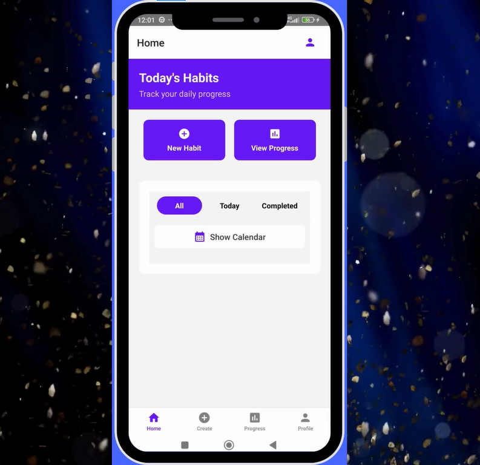
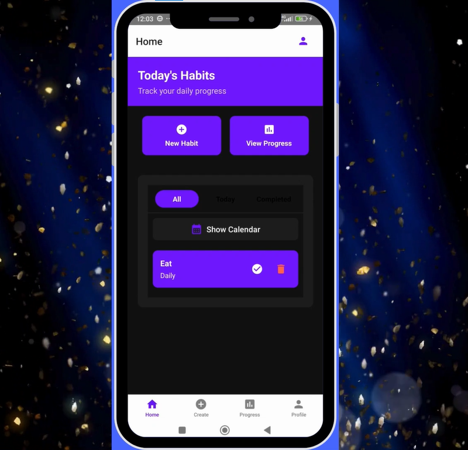
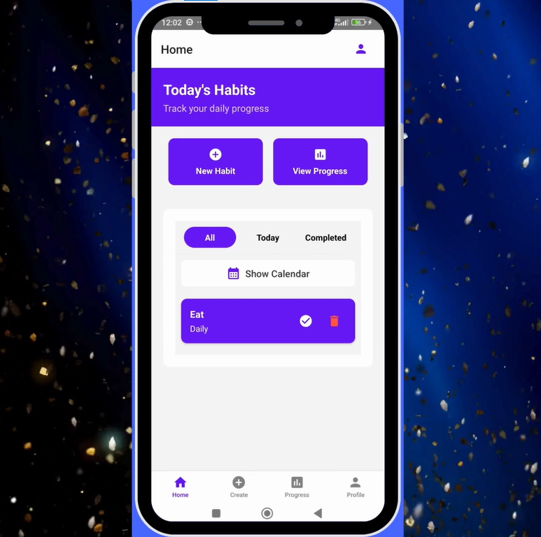
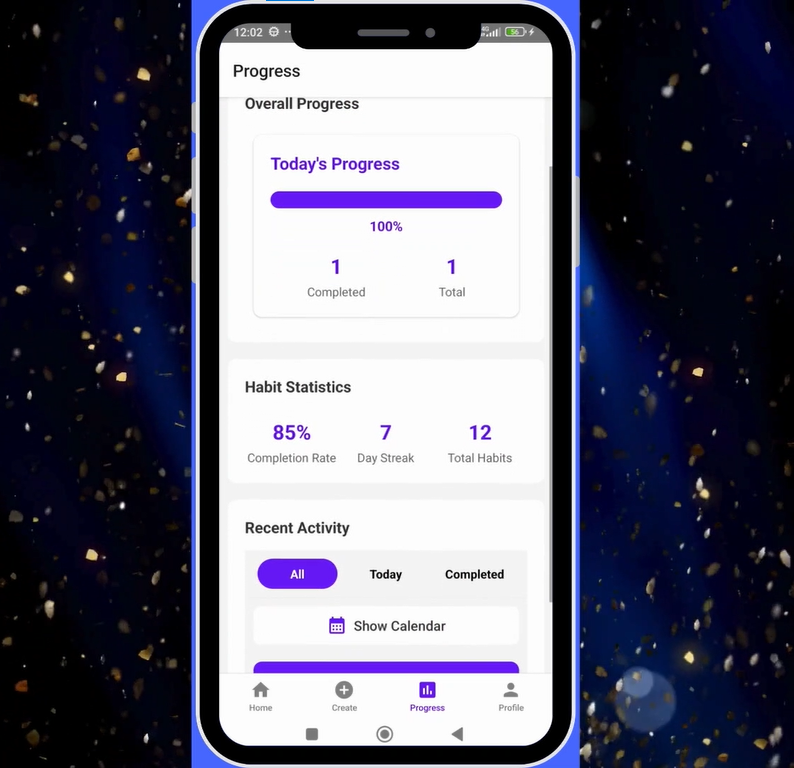

# 🎯 HabitTracker

<div align="center">
  

**Build Better Habits, Transform Your Life**

A beautifully designed mobile application built with React Native and Expo to help users create, track, and maintain healthy daily habits with ease.

[](https://reactnative.dev/)
[](https://expo.dev/)
[](https://www.typescriptlang.org/)
[](./LICENSE)

[📱 Download APK](#-installation) • [🎥 Demo Video](#-demo) • [📋 Features](#-features) • [🚀 Getting Started](#-getting-started)
</div>

---

## 🎥 Demo

<div align="center">
  <a href="https://habit-tracker-mobile-app-demo-video.netlify.app/">
    
  </a>

**[🎬 Watch Full Demo Video](https://habit-tracker-mobile-app-demo-video.netlify.app/)**

*Click the image above or the link to see HabitTracker in action*
</div>

## 📱 Screenshots

<div align="center">
  
  
  
  
</div>

## ✨ Features

### 🎯 Core Features
- **Create & Manage Habits** - Add new habits with custom names, descriptions, and colors
- **Daily Tracking** - Mark habits as complete or incomplete with a simple tap
- **Progress Visualization** - View your progress with beautiful calendar views and interactive charts
- **Smart Notifications** - Get reminded about your habits at the perfect time
- **Theme Support** - Switch between elegant dark and light themes

### 🔧 Advanced Features
- **Streak Tracking** - Monitor your longest streaks and current progress
- **Habit Categories** - Organize habits by categories (Health, Productivity, Personal, etc.)
- **Weekly/Monthly Views** - Analyze your performance over different time periods
- **Export Data** - Backup your progress and export statistics
- **Offline Support** - Works perfectly without internet connection

### 🎨 User Experience
- **Intuitive Interface** - Clean, modern design that's easy to navigate
- **Smooth Animations** - Delightful micro-interactions and transitions
- **Responsive Design** - Optimized for all screen sizes
- **Accessibility** - Built with accessibility best practices

## 🚀 Getting Started

### Prerequisites

Before you begin, ensure you have the following installed:
- [Node.js](https://nodejs.org/) (v16 or higher)
- [npm](https://www.npmjs.com/) or [Yarn](https://yarnpkg.com/)
- [Expo CLI](https://docs.expo.dev/get-started/installation/)
- [Git](https://git-scm.com/)

### 📲 Installation

1. **Clone the repository**
   ```bash
   git clone https://github.com/yourusername/habittracker.git
   cd habittracker
   ```

2. **Install dependencies**
   ```bash
   npm install
   # or
   yarn install
   ```

3. **Start the development server**
   ```bash
   npx expo start
   ```

4. **Run on your device**
  - Install [Expo Go](https://expo.dev/client) on your mobile device
  - Scan the QR code displayed in your terminal
  - Or press `a` for Android emulator, `i` for iOS simulator

### 🔧 Development Setup

```bash
# Install dependencies
npm install

# Start development server
npm start

# Run on Android
npm run android

# Run on iOS
npm run ios

# Run on web
npm run web

# Build for production
npm run build
```

## 🏗️ Built With

### Core Technologies
- **[React Native](https://reactnative.dev/)** - Mobile app framework
- **[Expo](https://expo.dev/)** - Development platform and tools
- **[TypeScript](https://www.typescriptlang.org/)** - Type-safe JavaScript
- **[React Navigation](https://reactnavigation.org/)** - Navigation library

### UI & Styling
- **[NativeBase](https://nativebase.io/)** / **[React Native Elements](https://reactnativeelements.com/)** - UI component library
- **[React Native Reanimated](https://docs.swmansion.com/react-native-reanimated/)** - Advanced animations
- **[React Native Vector Icons](https://github.com/oblador/react-native-vector-icons)** - Icon library

### Data & Storage
- **[AsyncStorage](https://react-native-async-storage.github.io/async-storage/)** - Local data persistence
- **[React Native SQLite](https://github.com/andpor/react-native-sqlite-storage)** - Local database
- **[Redux Toolkit](https://redux-toolkit.js.org/)** - State management

### Additional Libraries
- **[React Native Calendars](https://github.com/wix/react-native-calendars)** - Calendar components
- **[Victory Native](https://formidable.com/open-source/victory/docs/native/)** - Data visualization
- **[Expo Notifications](https://docs.expo.dev/versions/latest/sdk/notifications/)** - Push notifications
- **[React Native Haptic Feedback](https://github.com/junina-de/react-native-haptic-feedback)** - Haptic feedback

## 📱 App Architecture

```
src/
├── components/          # Reusable UI components
│   ├── common/         # Common components (Button, Input, etc.)
│   ├── habits/         # Habit-specific components
│   └── charts/         # Chart and visualization components
├── screens/            # Screen components
│   ├── HomeScreen/     # Main dashboard
│   ├── HabitsScreen/   # Habits management
│   ├── ProgressScreen/ # Progress visualization
│   └── SettingsScreen/ # App settings
├── navigation/         # Navigation configuration
├── services/          # API and data services
├── store/             # Redux store and slices
├── utils/             # Helper functions and utilities
├── hooks/             # Custom React hooks
├── constants/         # App constants and themes
└── types/             # TypeScript type definitions
```

## 🎨 Design System

### Colors
```javascript
const colors = {
  primary: '#6366F1',
  secondary: '#8B5CF6',
  success: '#10B981',
  warning: '#F59E0B',
  error: '#EF4444',
  // ... more colors
}
```

### Typography
- **Headings**: Inter Bold
- **Body Text**: Inter Regular
- **Captions**: Inter Medium

## 📊 Features in Detail

### 🎯 Habit Management
- Create habits with custom names, descriptions, and icons
- Set habit frequency (daily, weekly, custom)
- Organize habits into categories
- Archive or delete habits

### 📅 Progress Tracking
- Visual calendar with completion status
- Streak counters and statistics
- Monthly and yearly overview
- Progress charts and analytics

### 🔔 Smart Notifications
- Customizable reminder times
- Motivational messages
- Streak milestone celebrations
- Daily summary notifications

## 🤝 Contributing

We love contributions! Please see our [Contributing Guide](CONTRIBUTING.md) for details.

### Development Process
1. Fork the repository
2. Create your feature branch (`git checkout -b feature/AmazingFeature`)
3. Commit your changes (`git commit -m 'Add some AmazingFeature'`)
4. Push to the branch (`git push origin feature/AmazingFeature`)
5. Open a Pull Request

### Code Style
- Follow ESLint and Prettier configurations
- Use TypeScript for type safety
- Write meaningful commit messages
- Add tests for new features

## 🧪 Testing

```bash
# Run unit tests
npm test

# Run tests with coverage
npm run test:coverage

# Run E2E tests
npm run test:e2e
```

## 📦 Building for Production

### Android
```bash
# Build APK
expo build:android

# Build AAB (recommended for Play Store)
expo build:android -t app-bundle
```

### iOS
```bash
# Build IPA
expo build:ios
```

## 🚀 Deployment

The app can be deployed through:
- **Expo Application Services (EAS)** - Recommended
- **Manual builds** using Expo CLI
- **Direct submission** to app stores

## 📱 Download

<div align="center">

[](https://play.google.com/store/apps/details?id=your.app.id)
[](https://apps.apple.com/us/app/your-app-name/id123456789)

Or download the APK directly: [📱 Download APK](https://github.com/yourusername/habittracker/releases/latest)

</div>

## 📄 License

This project is licensed under the MIT License - see the [LICENSE](LICENSE) file for details.

## 👥 Team

<div align="center">
  <table>
    <tr>
      <td align="center">
        <a href="https://github.com/NadeeshaMedagama">
          
          <br />
          <sub><b>Nadeesha</b></sub>
        </a>
        <br />
        <sub>DevOps Enthusiast</sub>
      </td>
    </tr>
  </table>
</div>

## 🙏 Acknowledgments

- Design inspiration from leading habit tracking apps
- Icons from [Feather Icons](https://feathericons.com/)
- Illustrations from [Undraw](https://undraw.co/)
- Color palette inspired by [Tailwind CSS](https://tailwindcss.com/)

## 📞 Support

Having issues? We're here to help!

- 📧 Email: nadeeshamedagama@gmail.com
- 🐛 Bug Reports: [GitHub Issues](https://github.com/NadeeshaMedagama/HabitTracker_mobile_application_with_react-native.git/issues)
- 💬 Discussions: [GitHub Discussions](https://github.com/NadeeshaMedagama/HabitTracker_mobile_application_with_react-native.git/discussions)
- 📱 Social: [@HabitTrackerApp](https://twitter.com/habitrackerapp)

## 🗺️ Roadmap

### 🔄 Version 2.0 (Coming Soon)
- [ ] Social features - Share progress with friends
- [ ] Habit templates and community suggestions
- [ ] Advanced analytics and insights
- [ ] Wearable device integration
- [ ] Habit coaching and tips

### 🎯 Future Features
- [ ] Web application companion
- [ ] Team habit challenges
- [ ] Integration with health apps
- [ ] AI-powered habit recommendations
- [ ] Multi-language support

---

<div align="center">
  <p>Made with ❤️ for habit builders everywhere</p>

**[⭐ Star this repository](https://github.com/NadeeshaMedagama/HabitTracker_mobile_application_with_react-native.git) if you found it helpful!**

<sub>HabitTracker © 2024. All rights reserved.</sub>
</div>
